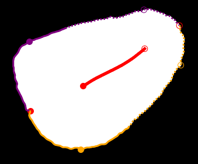
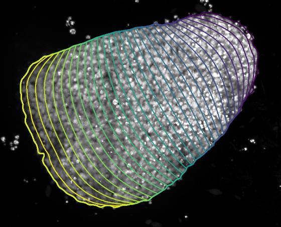
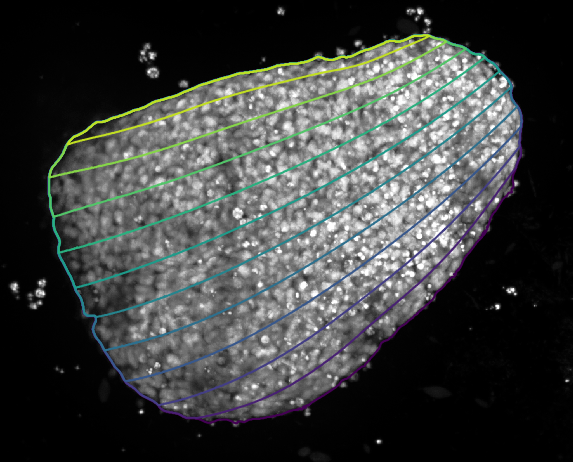
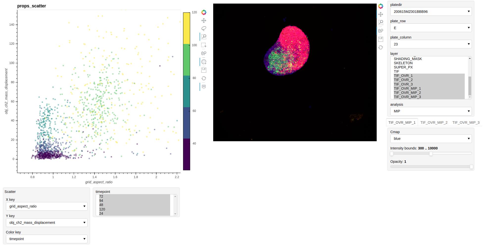

# Goid
Image analysis of gastruloid screen

## Installation
It is recommended to create a new python environment and install visualization libraries and cuda (GPU support) with conda:

```bash
conda create -n goid python=3.7
conda activate goid
conda install -c pyviz holoviews bokeh panel param xarray datashader pytables
conda install cudatoolkit=10.1 cudnn=7

git clone https://github.com/fmi-basel/gastruloid_quant.git
pip install gastruloid_quant/
```


## Usage
The complete analysis pipeline, except training deep learning models, can be run from command line, where [luigi.cfg](luigi.cfg) is a config file for the experiment:

```bash
LUIGI_CONFIG_PATH=CONFIG_DIR/luigi.cfg goid
```

Samples for which the output files already exist are skipped. To rerun the analysis intermediate and final outputs should be deleted. The final aggregation step collects all extracted features so far and is performed on every call. The aggregated outputs are saved in a new sub-folder `workflow_out_[timestamp]`.

## Configuration file
An example of the configuration file is given below. A good location would be at the root of the experiment folder it applies to.

```
[ParseGoidCollectionTask]
# parsing pattern matching the experiment files
# fields should include at least the ones used for indexing
pattern={platedir}/{subdir}/{date:06d}MZ{timepoint:03d}BBB{f1:02d}_{plate_row}{plate_column:02d}_{tail}Z{zslice:02d}C{channel:02d}.{ext}
index=["platedir", "subdir", "plate_row", "plate_column", "channel", "zslice"]

# If a plate layout is provided, the channels below can be configured by staining name instead of id.
#~ plate_layout=plate_layout.xlsx

[PredictForegroundTask]
min_object_size=1000
model_dir=models/foreground
channel=1

[PredictDebrisTask]
model_dir=models/debris
channel=3

[PredictSeparatorTask]
model_dir=models/separator
channels=[1, 2, 3, 4]

[SkeletonTask]
use_separator=True

[GridTask]
longitudinal_segments=[3, 100]
orientation_channel=3

[ShadingMaskTask]
shading_channel=1

[MIPPropTask]
mask_debris=True
spx_props=False
ch_to_stain=False

[MiddlePlaneTask]
channel=1

[MiddleSlicePropTask]
ch_to_stain=False

[SuperPixelTask]
cell_area=300
channel=1

[MIPSuperPixelTask]
cell_area=300
channel=1

[AggreatePropsTask]
# extra fields parsed from filenames to include in the exported features (in addition to index)
props_extra_index=["timepoint"]

[CompleteWorkflow]
compute_mip_props=True
compute_middle_props=False
aggregate_existing_props=True
datadir=data/

# optionally only process certain files
#~platedir=["210102MZ101BBB48"]
#~plate_row=["A", "B"]
#~plate_column=[2, 4]

[resources]
gpu_submitter:2

[core]
workers:32
log_level=INFO
```

## Pipline details

### Foreground/background segmentation
Objects (foreground) are predicted with a deep learning model applied to the DAPI channel. A fully convolutional neural network is trained with soft-Jaccard loss on manually curated threshold-based segmentation masks. If more than one object is present, only the largest is kept.

#### Training
Training parameters can be configured through a config file, see [luigi_training.cfg](luigi_training.cfg) for an example. Running ```LUIGI_CONFIG_PATH=./luigi_training.cfg goid_train_fg``` will build a tensorflow record, generate a pdf with training examples, train the model and save the final version as a tensorflow graph.

#### Annotating images
Training images can be annotated with user prefered application or trough a web-based editor available in the following notebook: [annotator.ipynb](notebooks/annotator.ipynb).

### Skeleton
Medial axis skeleton is computed from the object mask (set of all points having more than one closest point on the object's boundary or in other words ridges of the distance transform). To avoid small spurious branches, the distance transform is smoothed with a Gaussian kernel prior to extracting the ridges.

#### Predicting curled gastruloids separator
Optionally, to handle curled gastruloids, another deep learning model is used to predict a separator that splits the mask along the folding line. This separator is subtracted from the distance transform prior to extracting the ridges. Similarly to the foreground prediction, a model can be trained by running ```LUIGI_CONFIG_PATH=./luigi_training.cfg goid_train_separator```.

### Template matching
A regular rectangular grid is deformed to the shape of the mask and can be used to measure length/width of the gastruloid as well as intensity profile along its length.

First "gastruloid's corners" are determined. The skeleton is extrapolated until the object boundaries. if the skeleton has side branches, the 2 ends resulting in the longest path are chosen. The template corners (orange/purple points) are defined as points on the contour that are equidistant from the skeleton ends and extended-skeleton ends (red points)



Equidistant points are placed along the contour between each corner, thus defining a mapping for the edges of a regular grid.  These control points are used to map the rest of the grid with thin plate interpolation.

 

Finally, the grid orientation along the length of the gastruloid is normalized so that the mean intensity of a reference channel over the second half of the grid is always larger than over the first half.


### Shading defects
Binary mask of foreground-shaded areas is obtained by thresholding the DAPI channel. By default, the threshold is set at 30% of the difference between background intensity (10th percentile) and the object intensity (90th percentile).

### Fluorscent debris
Some images present relatively bright fluorescent debris that have distinctive shape and texture. Binary mask of those debris is predicted by a fully convolutional neural network trained on manual annotations. Similarly to the foreground prediction, a model can be trained by running ```LUIGI_CONFIG_PATH=./luigi_training.cfg goid_train_debris```.

### Feature extraction
Intensity features (mean, std, quantiles) are computed on image, object, super-pixels and segment levels. Segments are subdivision of the gastruloid along its length or width according to the mapped grid. Instead of MIPs, certain features, such as super-pixel are extracted from the middle slice taken as the slice having the maximum intensity in the DAPI channel. Shading and debris masks are excluded from the object and segments to measure intensity features. Morphological features are measured on the object mask (including shaded/debris regions).

Nomenclature:

- prefix
	- obj_: object level
	- img_: image level
	- l3seg001: segment level {length/width}{total number of segments}seg{segment index starting at 0}
- _q...: quantiles
	- q0_000: minimum
	- q0_250: first quartile
	- q0_500: median
	- q0_750: third quartile
	- q1_000: maximum
	- ...
- length/width: mean/std/quantiles measured along the deformed grid

## Interactive data visualization

Masks and extracted features can be visualized with the following notebook: [webview.ipynb](notebooks/webview.ipynb). The application can also be directly opened in a browser (i.e. without seeing the notebook code) with the following command.


If a graphical interface is available:
```bash
panel serve --show notebooks/webview.ipynb
```

Else start the server with the command below, open a browser and navigate to WORKSTATION:PORT
```bash
panel serve --port PORT --allow-websocket-origin WORKSTATION:PORT notebooks/webview.ipynb
```



## Testing
```pytest tests/```
